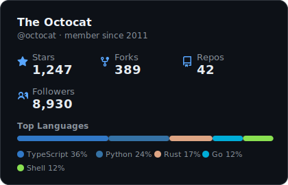
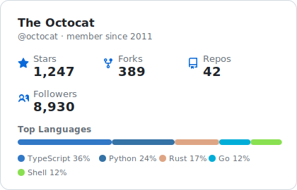
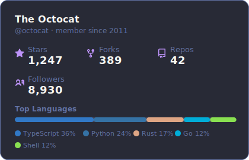
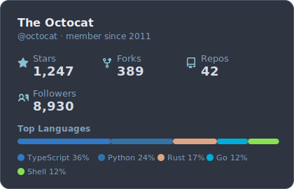
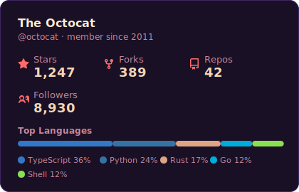

# 📊 github-stats-card

Gera cards SVG bonitões com as estatísticas do seu perfil no GitHub. Use no seu README, portfólio ou em qualquer lugar que renderize imagens.

<p align="center">
  
</p>

## Funcionalidades

- **5 temas** — Escuro, Claro, Dracula, Nord, Sunset
- **Top linguagens** — detectadas automaticamente dos seus repositórios
- **Zero dependências** — só TypeScript + a API do GitHub
- **Animado** — animações sutis de fade-in ao carregar
- **CLI incluso** — gera cards direto pelo terminal

## Início Rápido

```bash
# clone o repo
git clone https://github.com/PedroHFerraz/github-stats-card.git
cd github-stats-card

# instale as dependências
npm install

# gere um card
npx ts-node src/cli.ts torvalds --theme dracula
```

Isso cria o arquivo `torvalds-stats.svg` na pasta atual.

## Como Usar

### Pelo Terminal (CLI)

```bash
npx ts-node src/cli.ts <usuario> [opções]
```

| Opção | Descrição | Padrão |
|---|---|---|
| `--theme <nome>` | `dark` `light` `dracula` `nord` `sunset` | `dark` |
| `--no-langs` | Esconde a barra de linguagens | — |
| `--no-border` | Remove a borda do card | — |
| `--width <px>` | Largura do card em pixels | `420` |
| `--output <arquivo>` | Caminho do arquivo de saída | `<usuario>-stats.svg` |

### Como módulo

```typescript
import { fetchUserStats, renderCard } from "./src";

const stats = await fetchUserStats("torvalds");
const svg = renderCard(stats, {
  username: "torvalds",
  theme: "nord",
  showLanguages: true,
});

// svg é uma string — salve num arquivo, sirva numa API, incorpore onde quiser
```

### No seu README

Depois de gerar seu card, adicione ao repositório e referencie assim:

```markdown

```

## Temas

<table>
  <tr>
    <td align="center"><strong>Escuro</strong><br/></td>
    <td align="center"><strong>Claro</strong><br/></td>
  </tr>
  <tr>
    <td align="center"><strong>Dracula</strong><br/></td>
    <td align="center"><strong>Nord</strong><br/></td>
  </tr>
  <tr>
    <td align="center" colspan="2"><strong>Sunset</strong><br/></td>
  </tr>
</table>

## Limites da API

A API do GitHub permite 60 requisições por hora sem autenticação. Para aumentar esse limite, crie um [token pessoal](https://github.com/settings/tokens) (não precisa de nenhum escopo) e configure:

```bash
export GITHUB_TOKEN=ghp_seu_token_aqui
```

## Estrutura do Projeto

```
src/
├── card.ts       # Renderizador SVG
├── cli.ts        # Entrada do CLI
├── fetcher.ts    # Cliente da API do GitHub
├── index.ts      # Exports públicos
├── preview.ts    # Gerador de previews
├── themes.ts     # Definições de temas + cores das linguagens
└── types.ts      # Tipos TypeScript
```

## Licença

MIT
